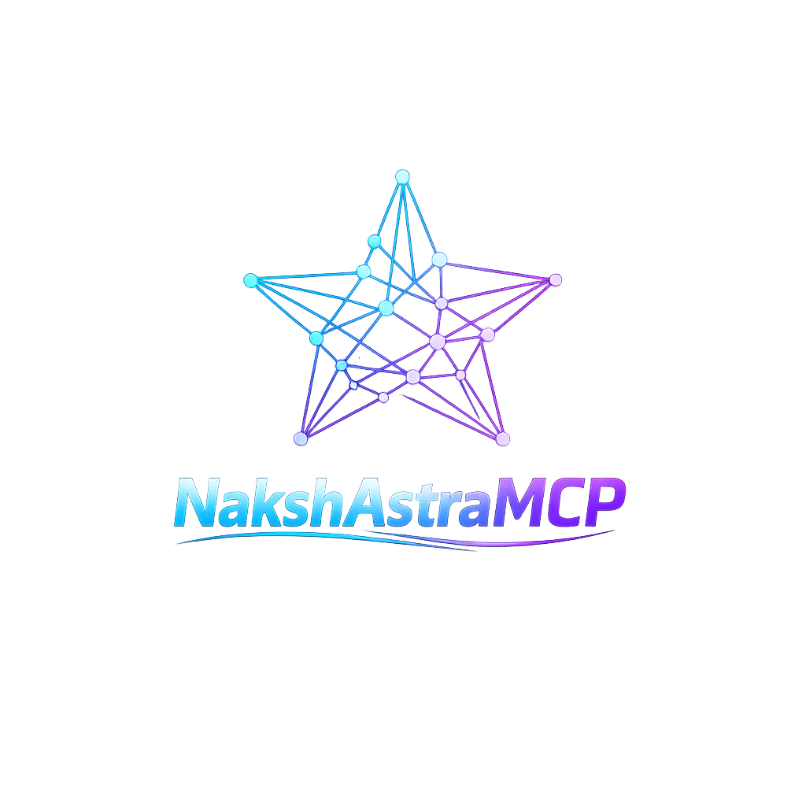
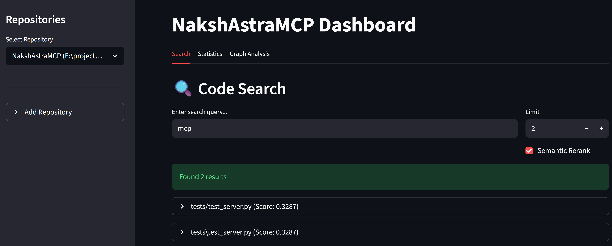

<div align="center" markdown="1">



**The ultimate high-performance code context engine for AI-native development.**

[](LICENSE)
[](#)
[](#)

</div>

---

## 📖 Overview

NakshAstraMCP provides AI agents (Claude, Cursor, Antigravity, etc.) with deep, structural understanding of your local codebase. Using advanced AST parsing and high-speed semantic ranking, it delivers the exact context your developer tools need to solve complex problems across large projects.

### 🗺 Documentation Hub
Quickly navigate to detailed guides:

| 🚀 [Setup Guide](SETUP.md) | 📖 [User Guide](USER_GUIDE.md) | 🤖 [Agent Guide](agent.md) |
| :---: | :---: | :---: |
| *Install & Configure* | *Advanced Usage & Tips* | *Behavioral Guide for AI* |

| 📜 [LICENSE](LICENSE) | 🛡 [Security Policy](SECURITY.md) | 💬 [Discussions](DISCUSSIONS_WELCOME.md) |
| :---: | :---: | :---: |
| *LICENSE * | *Privacy & Data Safety* | *Community & Support* |
| | [🛠 Troubleshooting](TROUBLESHOOTING.md) | |

---

## 🏆 Assessment & Performance

- **Overall Efficiency**: **9.3 / 10** (Industry-leading structural context)
- **Index/Search Latency**: **~0.68ms p95** (Ultra-low latency on 10,000-file repos)
- **Idle Memory**: **< 150 MB RAM**
- **Language Support**: Deep AST integration for **Python, JavaScript, TypeScript, Java, and Kotlin**.

<br>

<div align="center">
  
  <p><em>Lightning-fast hybrid search across multiple repositories.</em></p>
</div>

### ✨ Key Features
- 🔍 **Hybrid Multi-Repo Search** — Indexed search across all your projects simultaneously.
- 🧠 **Semantic Reranking** — AI-powered results prioritized by conceptual relevance using FlashRank.
- 🌳 **AST-Aware Analysis** — Understands code structure (classes, functions, imports) natively.
- 🩺 **Surgical Intelligence** — High-precision tools (`read_file`, `find_symbol`, `find_references`) for localized context retrieval.
- 🛡️ **Administrative Control** — Full CLI control over server lifecycle (`stop`, `restart`, `logs`).
- 👁️ **Real-Time Watcher** — Changes are indexed instantly with mass-update protection.
- 🧩 **Runtime Language Addons** — Provision new Tree-sitter grammars at runtime.
- 📈 **Visual Dashboard** — Interactive Nebula Graph UI with health monitoring.
- 🧹 **Operational Resilience** — Built-in Memory Guard and WAL checkpointing for stability.

<div align="center">
  
  <p><em>Detailed indexing statistics and server health monitoring.</em></p>
</div>

---

## 🚀 Quick Start (Fast-Track)

### 1. Unified Installation
Requires [uv](https://astral.sh/uv). Install the secure binary wheel directly:

**📥 [Download v3.10.0 Secure Wheel (Windows)](https://github.com/vijaytank/NakshAstraMCP-Docs/releases/download/3.0.0/nakshastramcp-3.10.0-cp313-cp313-win_amd64.whl)**

```powershell
uv tool install https://github.com/vijaytank/NakshAstraMCP-Docs/releases/download/3.0.0/nakshastramcp-3.10.0-cp313-cp313-win_amd64.whl --force
```
or if you get any errors try 

```powershell
python -m pip install .\nakshastramcp-3.10.1-cp313-cp313-win_amd64.whl
```

### 2. Register & Index
Initialize your workspace roots to build the local knowledge graph:
```powershell
nakshastramcp start --workspace C:\path\to\your\project
```

### 3. Verification & Health
```powershell
nakshastramcp status  # Check indexing progress
nakshastramcp doctor  # Perform full environment audit
```

---

## 💻 Hardware Tiers

NakshAstraMCP adapts to your system automatically:

| Tier | Specs | Capabilities |
|------|-------|-------------|
| **Minimal** | 2 cores / 4 GB RAM | Core search engine |
| **Recommended** | 4 cores / 8 GB RAM | + Semantic reranking + High-performance indexing |
| **Optimal** | 8+ cores / 16 GB RAM | Full graph analysis + Deep reranking |

---

## 🌉 Multi-Client Connectivity

NakshAstraMCP supports concurrent sessions from multiple IDEs via the **Dual Transport Bridge**.

- **Primary Host**: Your main IDE (e.g., Cursor) starts the host session.
- **HTTP Follower**: Configure secondary tools (e.g., VS Code extension) to connect to the bridge:
  - **URL**: `http://127.0.0.1:2102/mcp`
  - **Type**: `streamable-http`

---

## 🛡 Security & Privacy

- **100% Local**: No source code or indices ever leave your machine.
- **Sensitive Data Detection**: Integrated secret scanner prevents indexing of API keys.
- **Sandboxed Execution**: The engine only accesses registered workspace roots.
- **Zero Telemetry**: No usage data is collected. Fully offline operation.

---

<div align="center">
  <p>&copy; 2026 Vijay Tank. All rights reserved.</p>
</div>
