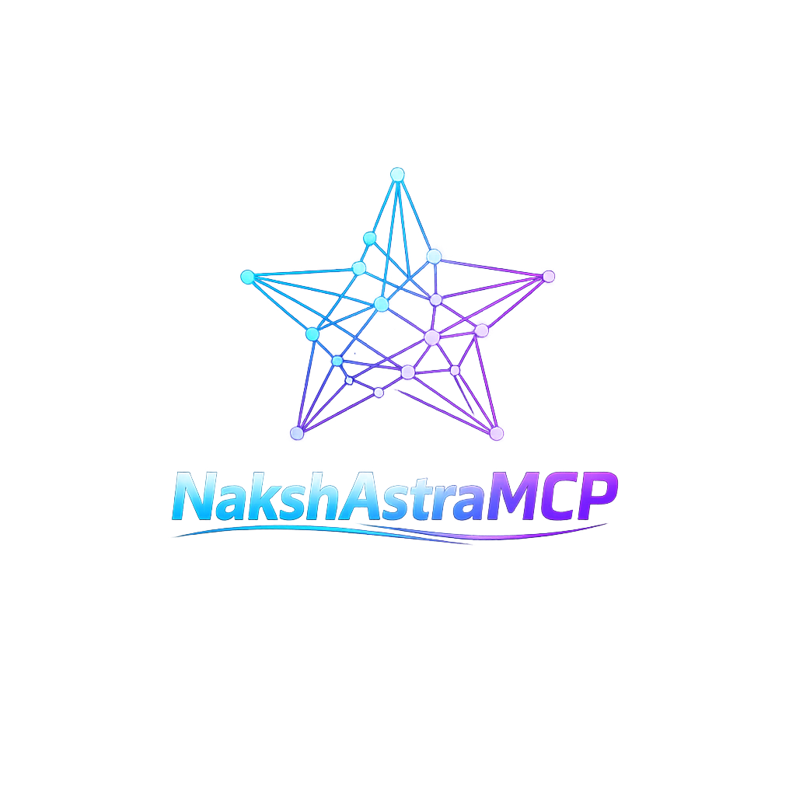
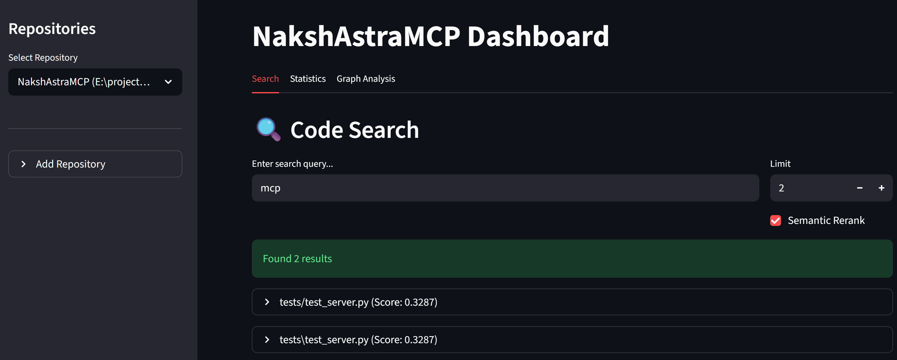
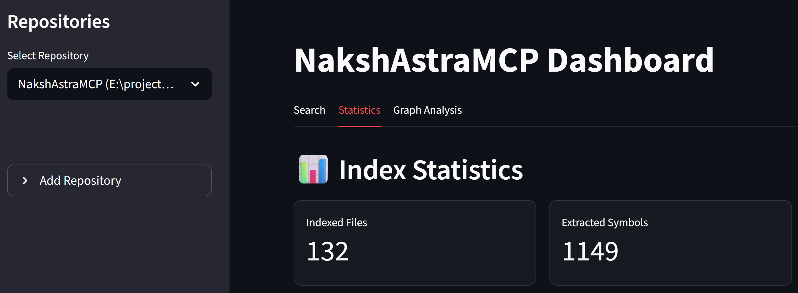

<div align="center" markdown="1">



# NakshAstraMCP

**The ultimate high-performance local code context engine for AI-native software development.**

[](LICENSE)
[](#)
[](#)
[](https://github.com/vijaytank/NakshAstraMCP-Docs/releases/tag/v3.20.0)

</div>

---

## 📖 Search & Discoverability Overview

**NakshAstraMCP** is an ultra-fast, local-first **Model Context Protocol (MCP)** server built to empower AI coding assistants (including **Claude Desktop**, **Cursor IDE**, **Windsurf**, and **Antigravity**) with a deep, AST-accurate, structural understanding of your codebases. 

Unlike generic text searches or broad file dumps that inflate your LLM token costs and dilute context, NakshAstraMCP parses class hierarchies, function boundaries, and cross-file reference graphs to supply AI agents with the *exact* context required to solve complex programming tasks safely.

### 🧭 Documentation Hub
Explore detailed guides to onboard, optimize, and secure your development workflows:

| 🚀 [Setup Guide](SETUP.md) | 📖 [User Guide](USER_GUIDE.md) | 🤖 [Agent Guide](AGENTS.md) |
| :---: | :---: | :---: |
| *Step-by-step Installation* | *Advanced Usage & CLI Control* | *Behavioral System Prompt Instructions* |

| 📜 [License](LICENSE) | 🛡️ [Security Policy](SECURITY.md) | 💬 [Community Discussions](DISCUSSIONS_WELCOME.md) |
| :---: | :---: | :---: |
| *Usage Terms* | *Local Privacy & Safety* | *Q&A, Ideas & Feedback* |
| [🎯 MCP-First Skill](mcp_first_skill.md) | [🛠️ Troubleshooting](TROUBLESHOOTING.md) | |

---

## 🏆 Performance Benchmarks & Efficiency

*   **⚡ Search Latency**: **~0.68ms (p95)** on medium-to-large code repositories.
*   **🧠 Semantic Alignment**: CPU-bound FlashRank reranker matches results based on programming intent.
*   **🍃 Footprint**: Incredibly lightweight (runs under **< 150 MB idle RAM** with automatic garbage collection).
*   **Tree-sitter Language Support**: Deep out-of-the-box AST parsing for **Python, JavaScript, TypeScript (TSX), Java, Kotlin, and Swift**.
*   **📉 Token Savings**: Reduces LLM context payload sizes and costs by up to **75%**.

### 📊 Context Retrieval Metrics vs. Manual Analysis
We tested NakshAstraMCP on a large commercial codebase with over 10,000 source files.

| Metric | With NakshAstraMCP | Without MCP (Manual Search) | **Efficiency Win** |
| :--- | :--- | :--- | :--- |
| **Context Fidelity** | **High**: specific AST symbols & immediate neighbors | **Low**: scattered keyword-only search layers | **High-Precision Context** |
| **LLM Token Cost** | **$0.09** | **$0.37** | **75% Cost Reduction** |
| **Wall Clock Time** | **1m 21s** | **2m 05s** | **35% Speed Increase** |

<br>

<div align="center">
  
  <p><em>Sleek multi-repository hybrid search with instant lexical routing.</em></p>
</div>

---

## ✨ Features & Architecture Capabilities

*   🔍 **Multi-Repo Hybrid Search** — Search and merge context across all your projects simultaneously.
*   🧠 **Semantic Reranking** — Employs advanced machine learning reranking to prioritize conceptual relevance.
*   🌳 **AST-Aware Truncation** — Returns complete, syntactically valid classes or functions instead of arbitrarily sliced text blocks.
*   📊 **PageRank Relevance** — Grades code importance based on cross-file call frequency and import patterns.
*   🤖 **Automated Agent Orchestration & Skills** — Automatically provisions project-specific `AGENTS.md` instructions and supports the standard [🎯 MCP-First Skill Profile](mcp_first_skill.md) to guide AI coding assistants.
*   🛡️ **Access Control Jail** — Strictly sandboxed to registered project roots; protects sensitive environments.
*   👁️ **Real-Time Workspace Watcher** — Debounces filesystem updates with automatic mass-update safeguards.
*   🧩 **Runtime Language Addons** — Provision new Tree-sitter grammars (e.g., Go, Rust, Ruby) at runtime.
*   🧹 **Operational Resilience** — Built-in Memory Guard prevents system memory leaks during long-running tasks.
*   📈 **Nebula UI Dashboard** — High-fidelity Streamlit visualization tool to analyze context graphs.

<div align="center">
  
  <p><em>Real-time indexing statistics and memory usage tracking.</em></p>
</div>

---

## 🚀 Quick Start (Fast-Track)

### 1. Prerequisite
Ensure [uv](https://astral.sh/uv) (fast Python package manager) is installed on your system:
```powershell
# Windows (PowerShell)
powershell -c "irm https://astral.sh/uv/install.ps1 | iex"
```

### 2. Universal Wheel Installation
NakshAstraMCP is distributed as a pre-compiled secure binary wheel for maximum performance:

**📥 [Download v3.20.0 Secure Wheel (Windows)](https://github.com/vijaytank/NakshAstraMCP-Docs/releases/)**

Install the wheel directly into your global environment:
```powershell
uv tool install https://github.com/vijaytank/NakshAstraMCP-Docs/releases/download/3.20.0/nakshastramcp-3.20.0-cp313-cp313-win_amd64.whl --force
```
*Alternatively, using standard Python pip:*
```powershell
python -m pip install .\nakshastramcp-3.20.0-cp313-cp313-win_amd64.whl
```

### 3. Register & Index Workspace
Navigate to your target codebase and register it:
```powershell
nakshastramcp start --workspace C:\path\to\your\project
```

### 4. Verify Server Health
Ensure your indexing is complete and the runtime environment is pristine:
```powershell
nakshastramcp doctor   # Comprehensive pre-flight system diagnostics
nakshastramcp status   # View active indexing states and repositories
```

---

## 💻 System Configuration & Hardware Tiers

The engine scales dynamically based on system capabilities:

| Tier | Minimum Specs | Features Enabled |
| :--- | :--- | :--- |
| **Minimal** | 2 CPU Cores / 4 GB RAM | Core keyword search, aggressive Memory Guard cleanups |
| **Recommended** | 4 CPU Cores / 8 GB RAM | + Tantivy FTS, CPU FlashRank Semantic Reranking |
| **Optimal** | 8+ CPU Cores / 16 GB RAM | + PageRank graph calculations, deep AST relationship mapping |

---

## 🌉 Concurrent Multi-Client Connectivity

NakshAstraMCP integrates a **Dual Transport Bridge** allowing multiple IDEs and clients to share a single background session.
*   **Host Session**: Your primary editor (e.g., Antigravity or Cursor) spawns the host command utilizing `stdio` transport.
*   **HTTP Bridge**: The host automatically exposes a streamable HTTP connection on port `2102`.
*   **Secondary Clients**: Other clients (such as VS Code extensions or external AI scripts) can connect to the shared context simultaneously via:
    *   **URL**: `http://127.0.0.1:2102/mcp`
    *   **Type**: `streamable-http`

---

## 🛡️ Security & Privacy Guardrails

*   **100% Local Execution**: All indexes and calculations remain strictly on your local machine. No code leaves your system.
*   **Secret Detection**: Integrated secret scanners actively prevent the indexing of API keys, passwords, and sensitive keys.
*   **Jailed Paths**: Enforces strict sandboxing rules to block symbolic link exploits and access beyond authorized workspaces.

---

<div align="center">
  <p>&copy; 2026 Vijay Tank. All rights reserved.</p>
</div>
